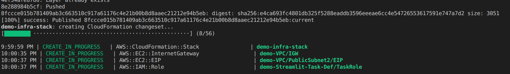

# AWS Lambda Container Implementation (+ EFS / Streamlit) through CDK


[AWS Lambda – Container Image Support](https://aws.amazon.com/blogs/aws/new-for-aws-lambda-container-image-support/)

This repo creates a CDK Stack that includes:
- a shared filesystem (EFS)  
- a Streamlit UI deployed onto a Fargate Service accessible through an Application Load Balancer  
- a Lambda bound to an API Gateway and EFS  

A usecase for this construct is CPU bound scalable ML model inference. 

It currently impelements no actual code logic and be used as a blueprint.

Streamlit it an optional component and could be replaced by any application / webserver or left out completly.
To disable Streamlit, just comment the code in /lambda_docker/lambda_docker_stack.py that indicates Streamlit.

## CDK

[AWS CDK (Cloud Development Kit)](https://docs.aws.amazon.com/cdk/latest/guide/getting_started.html lets you define cloud infrastructre as code. This project uses Python.

In order to use this repo, an AWS Account is required, [AWS CLI](https://docs.aws.amazon.com/cli/latest/userguide/install-cliv2.html) installed and configured as well as [AWS CDK](https://docs.aws.amazon.com/cdk/latest/guide/getting_started.html) installed.

**This repo will incur costs on an AWS Account**

### A short primer on AWS CDK
In theory, AWS CDK is very straightforward to use:
- **cdk deploy** (Deploys infrastructure)
- **cdk destroy** (Destroy deployed infrastructure)
- **cdk diff** (Similiar to a git diff shows differences between deployed and current stacks)
- **cdk ls** (Lists all the stacks/infrastructure in an app)
- **cdk synth** (Synthesizes and prints Cloudformation template)

Under the hood, CDK translates stacks into Cloudformation templates, and these cloudformation templates get deployed.

Sometimes AWS CDK can get stuck during deploy/delete phases, and in order to clean an AWS Account from fragments its important to understand how to clean up resources manually.

A best practice is to deploy/develop into a sandbox account initally for testing.

Different stacks can cause different issues. In this case, it might happen that the ECS Cluster gets stuck and cannot be deleted.

Should this be the case, look up ECS, select the relevant cluster, select tasks, stop all running tasks and delete the cluster manually. Should there be already a job pending, it might then become unstuck and continue. Alternatively, it is possible to destroy the stack again. In this specific case, it is probably related to Streamlit not correctly allowing to shut down.


## Structure
This project contains 3 core components:
- **lambda_docker** - contains the CDK code that deploys the infrastructure
- **model** - contains the Lambda function including an example mount to EFS and how to read / write to it
- **streamlit-docker** - contains a streamlit instance exposed by a application load balancer and connected to the API Gateway to access the Lambda + EFS mount


## How to use
From the root folder of this project - set up an environnment (Linux/Max)
```
$ python3 -m venv .venv
$ source .venv/bin/activate
$ pip install -r requirements.txt
```

### Configure the project name and your AWS account in cdk.json
This allows to deploy the project onto multiple cloud accounts by switching out the account name e.g.:
```
"aws-account": "YOUR AWS ACCOUNT #",
"name" : "demo",
"aws-region" : "eu-central-1"
```

Check that the stack is visible 
```
$ cdk ls
```

As next step we can deploy the stack:
```
$ cdk deploy stack_name
```

The inital deploy will take some time as it has to build everything from ground up:
- Building the infrastructure  
- Building the Containers and pushing deploying them  

If an update is required and the stack is live, it is possible to update the running stack simply by:
```
$ cdk deploy stack_name
```


Once this process is completed, it will display two seperate URLs. These URLs change with every new redeploy.
- Streamlit Access URL  
- API URL (externally accessible)  

### !!!Destroying the stack!!!
After being done with the stack, it needs to be destroyed otherwise it keeps incurring costs.

```
$ cdk destroy stack_name
```

Currently the EFS Filesystem is configured as
```
removal_policy=core.RemovalPolicy.DESTROY
```
which means, all data will get destroyed. Remounting a stack to an existing Filesystem in case of a redeployment is not currently implemented in the current code but is possible by creating a seperate EFS Filesystem in a seperate stack and mounting via filesystem id:

```
taskdef.add_volume(
    name=f"{name}-volume",  
    efs_volume_configuration=ecs.EfsVolumeConfiguration(
            file_system_id=EFS_ID
    ))
```

